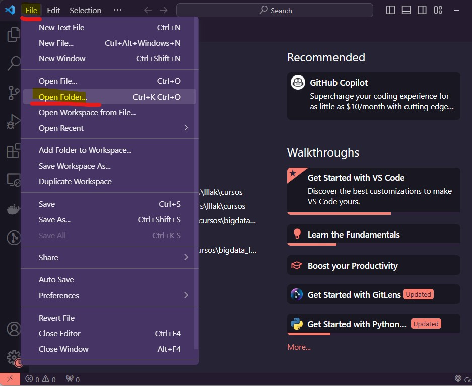

# Guía para levantar el entorno de la materia optativa en Windows

Esta guia considera el segundo método de instalación

> En tu computadore con Docker compose

**Requisitos**:
* Para tener disponible este repositorio en tu maquina de trabajo e instalar el software de la materia hay que instalar el programa [git](https://git-scm.com/download/win).

* [Docker compose](https://docs.docker.com/desktop/install/windows-install/).

Asegurarse de tener las siguientes características de windows habilitadas:


Software recomendado para interactuar con todos los recursos de la materia (en windows): [vscode](https://code.visualstudio.com/) y [powershell](https://learn.microsoft.com/es-es/powershell/scripting/overview?view=powershell-7.3) (la guía hace uso de ambas).

---

Ejecutamos **vscode** y luego abrimos el directorio con el repo de la materia:



Deberiamos ver el directorio a la izquierda con todos los archivos que se descargaron desde el repositorio:


Abrimos una terminal con la combinación de teclas ```Ctrl + Ñ```. En este caso la terminal es de tipo *powershell*.


Desde la terminal nos movemos al directorio ```/docker/compose```.


En ese directorio ejecutamos el siguiente comando:

```bash
docker compose up --build
```

Veremos varias líneas de log en la terminal, si queremos detener los contenedores debemos hacer ```Ctrl + C```


Luego debemos ir al navegador y escribir [http://localhost:8080](http://localhost:8080) para ver el entorno Zeppelin e interactuar con los notebooks. Recuerden que los notebooks se encuentran en la carpeta *clases* del repositorio y tienen la extensión ```.zpln```

## Para abrir una terminal en el contenedor

Mientras los contenedores están corriendo, abrimos una segunda terminal haciendo click en el botón '+' como se muestra en la siguiente imagen


Veremos en un panel a la derecha todas las terminales que tenemos abiertas y podemos alternar entre ellas. 


En la nueva terminal escribimos el siguiente comando:

```bash
docker exec -it diplodatos_bigdata bash
```

>Este comando docker ejecuta (*exec*) un shell interactivo (*bash*) en un contenedor (en este caso el de la materia: *diplodatos_bigdata*). 

>El argumento ```-it``` se utiliza para abrir una sesión interactiva (TTY) en el contenedor. El indicador -i (interactive) permite la interacción con la terminal del contenedor, y el indicador -t (pseudo-TTY) asigna un terminal pseudo-TTY, lo que permite la entrada y salida interactiva (según documentación).

veremos el prompt de la terminal del contenedor *diplodatos_bigdata* y podemos empezar a ejecutar comandos. Para salir de la terminal podemos usar el comando ```exit``` o la combinación de teclas ```Ctrl + D```


